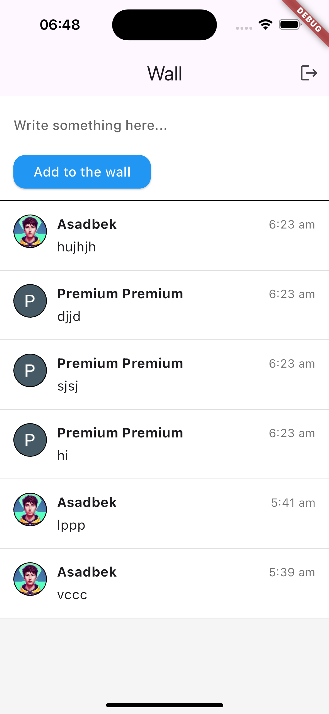

# Social Wall - Flutter App

## Overview

Social Wall is a simplified social media application built with Flutter and Firebase. It allows users to post short text messages to a public wall, similar to a streamlined version of Twitter. This project was developed as a demonstration of Flutter development skills, Firebase integration, and real-time data synchronization.

## Features

- Google Sign-In authentication
- Real-time post updates
- Ability to create text posts
- View posts from all users

## Technologies Used

- Flutter
- Firebase (Authentication, Firestore)
- BLoC pattern for state management
- Google Sign-In

## Getting Started

### Prerequisites

- Flutter SDK
- Firebase account
- Android Studio or VS Code with Flutter extensions

### Installation

1. Clone the repository:
   ```
   git clone https://github.com/yourusername/social-wall-flutter.git
   ```

2. Navigate to the project directory:
   ```
   cd social-wall-flutter
   ```

3. Install dependencies:
   ```
   flutter pub get
   ```

4. Set up Firebase:
   - Create a new Firebase project
   - Add an Android app to your Firebase project and download the `google-services.json` file
   - Place the `google-services.json` file in the `android/app` directory
   - Add an iOS app to your Firebase project and download the `GoogleService-Info.plist` file
   - Place the `GoogleService-Info.plist` file in the `ios/Runner` directory
   - Enable Google Sign-In in the Firebase Console

5. Run the app:
   ```
   flutter run
   ```

